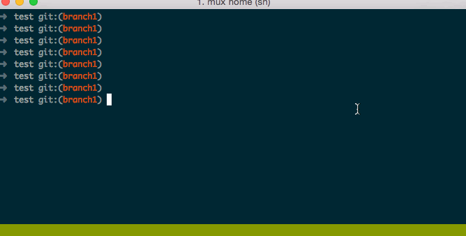

stash-command-line autocomplete plugin
======================================
stash-command-line plugin adds autocompletion for [stash-command-line tools](https://bitbucket.org/atlassian/stash-command-line-tools).



Installation
=========
oh-my-zsh
------
1. Go to your custom plugins folder:

    ```sh
    $ cd ${ZSH_CUSTOM:-$ZSH/custom}/plugins 
    ```
1. Then clone that repo:

    ```sh
    $ git clone git@github.com:evgeniy-baba/stash-command-line.git
    ```
1. Enabling plugin stash-command-line:

    ```sh
    $ $EDITOR ~/.zshrc

    # -plugins=(...)
    # +plugins=(... stash-command-line)
    ```
1. Customize:

    Add group(s) reviewers
    ```sh
    $ $EDITOR ~/.zshrc

    # +alias -g @team='@reviewer1 @reviewer2'
    ```

Usage
=====

-   Create a pull request from branch 'origin/branch' into branch 'origin/develop' with reviewers from group @team

    ```sh
    $ sclp origin/branch origin/develop @team
    ```
-   Open the Stash web ui for this repository

    ```sh
    $ sclb
    ```
